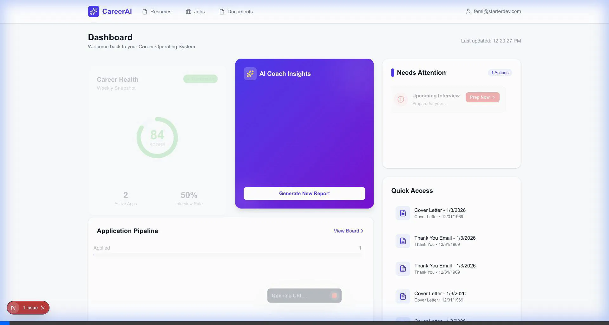

# CareerAI - Intelligent Career Management Platform



CareerAI is a comprehensive **Career Intelligence Platform** designed to help job seekers manage their career journey with data-driven insights. It transforms standard resume tracking into an actionable system using **Google Gemini 2.5 Flash** (Primary) and **OpenAI GPT-4o** (Fallback).

## 🚀 Key Features

### 1. 📊 Intelligent Dashboard
- **Career Health Snapshot**: Real-time 0-100 score of your job search momentum.
- **Priority Actions Engine**: "Needs Attention" feeds that prioritize critical tasks (e.g., upcoming interviews, stale applications).
- **Global Command Menu**: Navigate anywhere instantly with `Cmd+K`.
- **Pipeline Visualization**: Bento-box style view of your conversion funnel.

### 2. 🧠 Advanced Resume Intelligence
- **Gemini-Powered Analysis**: Leverages Google's **Gemini 2.5 Flash** for high-speed, accurate resume parsing and critique.
- **Deep Parsing & Preview**: Full support for **PDF**, **DOC**, and **DOCX** files with integrated in-app previews.
- **AI Scoring**: Get a effectiveness score with bullet-level improvement suggestions.
- **"Fix It" Automation**: Auto-rewrite weak resume sections with a single click.

### 3. 💼 Modern Job Application Pipeline
- **Job Description Hub**: Dedicated "Job Description" tab to manage and analyze the source of truth for every application.
- **Application Assets**: A smart panel that tracks which resume version was used, required documents, and next steps for every job.
- **Kanban Board**: Drag-and-drop tracking (Applied → Screening → Interview → Offer).
- **Match Analysis**: Compare your resume against detailed job descriptions to identify keyword gaps.
- **Interview Prep**: Generate tailored interview questions and STAR-method answers.

### 4. 🗂️ Document Link Hub
- **Central Repository**: Manage all your resumes, cover letters, and portfolio documents in one place.
- **Smart Linking**: Link specific documents to job applications for easy retrieval during interviews.
- **Universal Preview**: View Word documents and PDFs directly in the browser without downloading.

### 5. ⚡️ Smart Automation
- **Cover Letter Generator**: Create personalized cover letters in seconds.
- **Stale Application Detection**: Automatically flags applications that haven't moved in days.
- **LinkedIn Optimizer**: Turn your resume into a viral-ready LinkedIn post.

## 🛠 Technologies & Skills

### Frontend
- **Framework:** Next.js 16.1 (App Router)
- **Library:** React 19
- **Language:** TypeScript
- **Styling:** TailwindCSS v4, Lucide React
- **Motion:** Framer Motion

### Backend & Database
- **Platform:** Supabase
- **Database:** PostgreSQL
- **Auth:** Supabase Auth
- **Storage:** Supabase Storage
- **Security:** Row Level Security (RLS)

### AI & Intelligence
- **Primary:** Google Gemini 2.5 Flash
- **Fallback:** OpenAI GPT-4o

### State & Validation
- **State Management:** Zustand
- **Schema Validation:** Zod

### Deployment
- **Platform:** Vercel

### Tools
- **Kanban:** dnd-kit
- **Document Processing:** Mammoth.js (Word), PDF-parse
- **Testing:** Playwright

## 🏁 Getting Started

### Prerequisites
-   Node.js 20.9.0+
-   Supabase Account
-   Google Gemini API Key (Required)
-   OpenAI API Key (Optional/Fallback)
-   Brandfetch API Key (Optional, for logos)

### Installation

1.  **Clone the repository**
    ```bash
    git clone https://github.com/yourusername/ai-resume-analyzer.git
    cd ai-resume-analyzer
    ```

2.  **Install Dependencies**
    ```bash
    yarn install
    ```

3.  **Environment Setup**
    Create a `.env.local` file in the root directory:
    ```env
    NEXT_PUBLIC_SUPABASE_URL=your_supabase_url
    NEXT_PUBLIC_SUPABASE_ANON_KEY=your_supabase_anon_key
    GEMINI_API_KEY=your_gemini_api_key
    OPENAI_API_KEY=your_openai_api_key
    # Optional
    BRANDFETCH_API_KEY=your_brandfetch_key
    ```

4.  **Database Migration**
    Run the SQL scripts located in `supabase/migrations/` in your Supabase SQL Editor to set up the schema and RLS policies.
    -   `20240101000000_initial_schema.sql`: Core tables (profiles, resumes, jobs).
    -   `20240101000001_storage_bucket.sql`: Storage bucket for resume files.
    -   `20260103000000_add_match_analysis.sql`: Adds AI matching support.
    -   `20260103010000_add_interview_questions.sql`: Adds AI interview prep support.

5.  **Run Development Server**
    ```bash
    yarn dev
    ```

    Open [http://localhost:3000](http://localhost:3000) to view the app.

## 🧪 Testing

We have a comprehensive test suite using Playwright and safe scripts for AI integration testing.

-   **Run End-to-End Tests**:
    ```bash
    yarn test
    ```
-   **Test AI Integration** (Uses real API calls):
    ```bash
    yarn test:ai
    ```
-   **Unit Tests**:
    ```bash
    yarn test:unit
    ```

## 🔒 Security
-   **Authentication**: Managed via Supabase Auth.
-   **Data Privacy**: Row Level Security (RLS) ensures users can only access their own data.

## 📄 License
MIT
